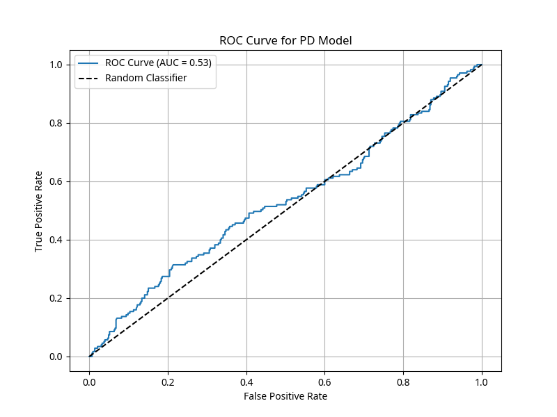
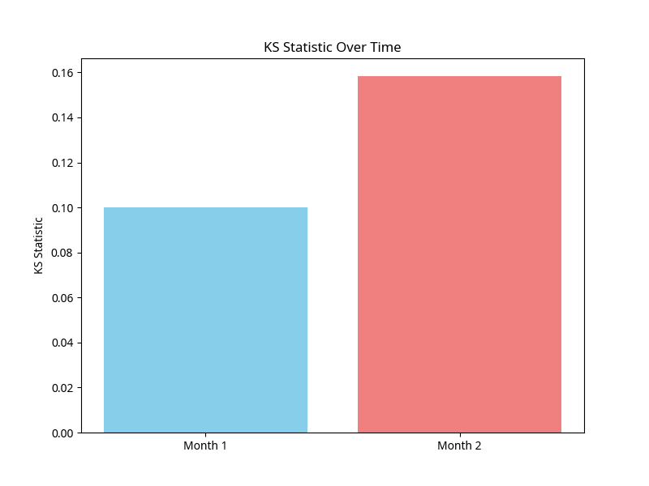
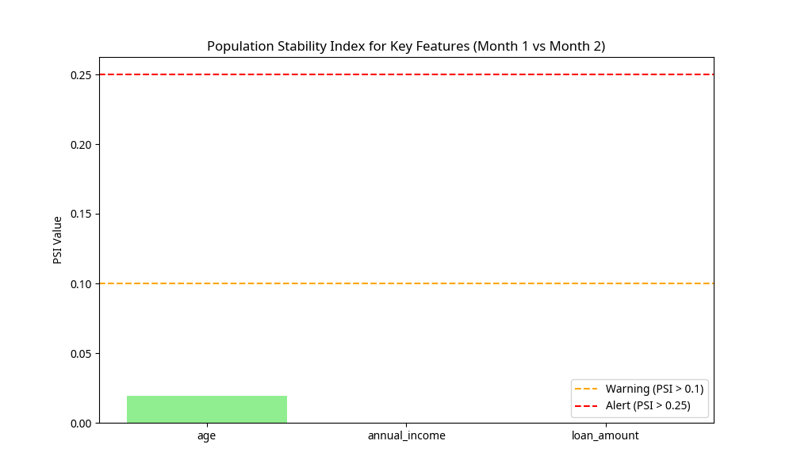

# Credit Risk Modeling Project Report

**Author:** Gajendra Diwedi
**Organization:** Feynn Labs
**Date:** 6/26/2025

## 1. Introduction

This report details a comprehensive Credit Risk Modeling project, simulating a real-world scenario from data generation to model monitoring. The objective is to build robust models for Probability of Default (PD), Loss Given Default (LGD), and Exposure at Default (EAD), which are crucial components in calculating Expected Loss (EL) for financial institutions. The project encompasses data simulation, extensive preprocessing and feature engineering, model development, and a critical look into model monitoring techniques to ensure ongoing performance and stability.

Credit risk is a fundamental concern for banks and other lending institutions. It refers to the potential for a borrower to default on their debt obligations. Accurate assessment and management of credit risk are paramount for maintaining financial stability, complying with regulatory requirements (such as Basel Accords), and optimizing capital allocation. This project provides a practical demonstration of the analytical and technical steps involved in developing such models.


## 2. Data Generation

To simulate a realistic credit risk environment, a synthetic dataset was generated. This approach allows for full control over data characteristics and ensures that sensitive financial information is not used. The dataset includes various demographic, application, behavioral, and credit history variables, along with target variables such as loan status, recovered amount, and total principal received.

### 2.1. Dataset Features

The synthetic dataset comprises the following key features:

*   **Demographics/Application Variables:** Age, annual income, employment length, home ownership, loan amount, purpose of loan, loan term, and verification status.
*   **Behavioral/Credit History:** Revolving utilization, revolving balance, earliest credit line, credit inquiries in the last 6 months, open credit lines, credit utilization, delinquencies in the last 2 years, and total current balance.
*   **Target Variables:** Loan status (fully paid, charged off, default), recovered amount (for defaulted loans), total principal received, and funded amount.

### 2.2. Data Generation Process

The data generation process involves creating random distributions for each feature, ensuring a realistic range and variety of values. For instance, `age` is generated within a typical working age range, `annual_income` follows a normal distribution, and `emp_length` is chosen from a predefined set of employment durations. Loan statuses are assigned with probabilities reflecting typical default rates.

The following Python code snippet illustrates the data generation process:

```python
import pandas as pd
import numpy as np
from datetime import datetime, timedelta

np.random.seed(42)

# Number of samples
n_samples = 2000

# Demographics / Application Variables
age = np.random.randint(22, 65, n_samples)
annual_income = np.random.normal(loc=70000, scale=25000, size=n_samples).astype(int)
annual_income[annual_income < 20000] = 20000 # Minimum income
emp_length = np.random.choice([f'{i} years' for i in range(1, 11)] + ['< 1 year', '10+ years'], n_samples)
home_ownership = np.random.choice(['RENT', 'OWN', 'MORTGAGE'], n_samples, p=[0.4, 0.2, 0.4])
loan_amount = np.random.normal(loc=15000, scale=7000, size=n_samples).astype(int)
loan_amount[loan_amount < 1000] = 1000 # Minimum loan amount
purpose = np.random.choice(['debt_consolidation', 'credit_card', 'home_improvement', 'other', 'major_purchase'], n_samples, p=[0.4, 0.3, 0.1, 0.1, 0.1])
loan_term = np.random.choice([' 36 months', ' 60 months'], n_samples, p=[0.7, 0.3])
verification_status = np.random.choice(['Verified', 'Source Verified', 'Not Verified'], n_samples, p=[0.35, 0.35, 0.3])

# Behavioral / Credit History
revol_util = np.random.normal(loc=0.4, scale=0.2, size=n_samples)
revol_util[revol_util < 0] = 0
revol_util[revol_util > 1] = 1
revol_bal = np.random.normal(loc=15000, scale=10000, size=n_samples).astype(int)
revol_bal[revol_bal < 0] = 0
earliest_credit_line = [datetime.now() - timedelta(days=np.random.randint(365 * 3, 365 * 20)) for _ in range(n_samples)]
credit_inquiries_last_6m = np.random.randint(0, 6, n_samples)
open_credit_lines = np.random.randint(2, 15, n_samples)
credit_utilization = np.random.normal(loc=0.5, scale=0.2, size=n_samples)
credit_utilization[credit_utilization < 0] = 0
credit_utilization[credit_utilization > 1] = 1
delinquency_2yrs = np.random.choice([0, 1, 2, 3], n_samples, p=[0.7, 0.2, 0.07, 0.03])
total_current_balance = np.random.normal(loc=50000, scale=30000, size=n_samples).astype(int)
total_current_balance[total_current_balance < 0] = 0

# Target Variables
loan_status = np.random.choice(['fully_paid', 'charged_off', 'default'], n_samples, p=[0.7, 0.2, 0.1])
recovered_amount = np.where(loan_status != 'fully_paid', np.random.uniform(0, loan_amount * 0.5, n_samples), 0)
total_rec_prncp = np.where(loan_status == 'fully_paid', loan_amount, np.random.uniform(0, loan_amount * 0.8, n_samples))
funded_amnt = loan_amount # For simplicity, assume funded_amnt is same as loan_amount for now

# Create DataFrame
data = pd.DataFrame({
    'age': age,
    'annual_income': annual_income,
    'emp_length': emp_length,
    'home_ownership': home_ownership,
    'loan_amount': loan_amount,
    'purpose': purpose,
    'loan_term': loan_term,
    'verification_status': verification_status,
    'revol_util': revol_util,
    'revol_bal': revol_bal,
    'earliest_credit_line': earliest_credit_line,
    'credit_inquiries_last_6m': credit_inquiries_last_6m,
    'open_credit_lines': open_credit_lines,
    'credit_utilization': credit_utilization,
    'delinquency_2yrs': delinquency_2yrs,
    'total_current_balance': total_current_balance,
    'loan_status': loan_status,
    'recovered_amount': recovered_amount,
    'total_rec_prncp': total_rec_prncp,
    'funded_amnt': funded_amnt
})

# Save to CSV
data.to_csv('credit_risk_synthetic.csv', index=False)
```

This process ensures a diverse and representative dataset for subsequent modeling steps. The generated dataset is saved as `credit_risk_synthetic.csv`.


## 3. Preprocessing & Feature Engineering

Data preprocessing and feature engineering are critical steps to transform raw data into a format suitable for machine learning models. This involves handling missing values, converting data types, creating new features, and applying transformations like Weight of Evidence (WOE) to prepare variables for modeling.

### 3.1. Data Cleaning and Transformation

Initial steps include converting categorical features like `emp_length` and `loan_term` into numerical representations. Dates, such as `earliest_credit_line`, are converted to a more usable format, calculating `months_since_earliest_credit`.

Missing values are handled by imputing numerical columns with their median and categorical columns with their mode. This prevents errors in subsequent steps and ensures data completeness.

### 3.2. Derived Features

Several new features are derived to capture more predictive power:

*   **`installment_to_income`**: Ratio of loan installment to annual income, indicating a borrower's debt burden.
*   **`credit_limit`**: Estimated credit limit derived from revolving balance and utilization.
*   **`credit_utilization_derived`**: Recalculated credit utilization based on the derived credit limit.

Infinite values, which can arise from division by zero (e.g., when `revol_util` is zero), are replaced with NaN and then imputed to ensure numerical stability.

### 3.3. Feature Binning

Continuous variables are binned into deciles using `pd.qcut`. This process, also known as fine classing, helps in handling non-linear relationships, reducing the impact of outliers, and preparing data for WOE transformation. If `qcut` fails due to insufficient unique values, a simpler binning method (`pd.cut`) is used.

### 3.4. Weight of Evidence (WOE) and Information Value (IV)

WOE and IV are widely used techniques in credit risk modeling for transforming categorical and binned numerical features. WOE measures the predictive power of an independent variable in relation to the dependent variable (default flag), while IV quantifies the overall strength of the relationship. Features with very low IV (e.g., < 0.02) are typically dropped as they contribute little to the model's predictive power.

The WOE transformation converts each category or bin of a feature into a numerical value based on the log odds of the target variable. This makes the features suitable for linear models like Logistic Regression and ensures that the relationship between the feature and the target is monotonic.

Below is the Python code for preprocessing and feature engineering:

```python
# Load the dataset
df = pd.read_csv("credit_risk_synthetic.csv")

# Convert emp_length to numerical
def emp_length_to_int(emp_len):
    if pd.isna(emp_len): return 0
    if isinstance(emp_len, (int, float)): return emp_len # Already converted
    if isinstance(emp_len, str):
        if '10+ years' in emp_len: return 10
        if '< 1 year' in emp_len: return 0
        return int(emp_len.replace(" years", ""))
    return 0 # Default for unexpected types
df["emp_length"] = df["emp_length"].apply(emp_length_to_int)

# Convert loan_term to numerical
df["loan_term"] = df["loan_term"].str.replace(" months", "").astype(int)

# Convert earliest_credit_line to datetime and calculate months_since_earliest_credit
df["earliest_credit_line"] = pd.to_datetime(df["earliest_credit_line"])
df["issue_date"] = datetime.now() # Assuming loans are issued now for simplicity
df["months_since_earliest_credit"] = ((df["issue_date"] - df["earliest_credit_line"]).dt.days / 30).astype(int)

# Drop issue_date and earliest_credit_line as they are no longer needed
df = df.drop(columns=["issue_date", "earliest_credit_line"])

# Missing Value Treatment (using median for numeric, mode for categorical)
for col in df.columns:
    if df[col].isnull().sum() > 0:
        if df[col].dtype in ["int64", "float64"]:
            df[col] = df[col].fillna(df[col].median())
        else:
            df[col] = df[col].fillna(df[col].mode()[0])

# Derived Features
df["installment_to_income"] = df["loan_amount"] / df["annual_income"]
# For credit_limit, we need to simulate it as it's not in the original synthetic data
df["credit_limit"] = df["revol_bal"] / df["revol_util"]
df["credit_limit"] = df["credit_limit"].replace([np.inf, -np.inf], np.nan).fillna(df["revol_bal"] * 2) # Handle division by zero or very small revol_util
df["credit_utilization_derived"] = df["revol_bal"] / df["credit_limit"]

# Replace infinite values with NaN before binning
for col in df.columns:
    if df[col].dtype in ["float64", "int64"]:
        df[col] = df[col].replace([np.inf, -np.inf], np.nan)

# Feature Binning (fine classing via quantiles for continuous variables)
# Select continuous variables for binning
continuous_vars = ["age", "annual_income", "loan_amount", "revol_util", "revol_bal", 
                   "credit_inquiries_last_6m", "open_credit_lines", "credit_utilization", 
                   "delinquency_2yrs", "total_current_balance", "installment_to_income", 
                   "months_since_earliest_credit", "credit_limit", "credit_utilization_derived"]

for col in continuous_vars:
    if col in df.columns:
        try:
            df[f"{col}_binned"] = pd.qcut(df[col], q=10, duplicates=\'drop\')
        except Exception as e:
            print(f"Could not bin {col}: {e}")
            # If qcut fails (e.g., not enough unique values), use simple binning
            df[f"{col}_binned"] = pd.cut(df[col], bins=10, duplicates=\'drop\')

# WOE & IV Calculation (simplified for demonstration)
# Define a simple function to calculate WOE and IV for a given feature and target
def calculate_woe_iv(df, feature, target):
    event_rate = df[target].mean()
    grouped = df.groupby(feature)[target].agg(["count", "sum"])
    grouped.columns = ["total", "bad"]
    grouped["good"] = grouped["total"] - grouped["bad"]
    grouped["dist_bad"] = grouped["bad"] / grouped["bad"].sum()
    grouped["dist_good"] = grouped["good"] / grouped["good"].sum()
    grouped["woe"] = np.log(grouped["dist_bad"] / grouped["dist_good"])
    grouped["iv"] = (grouped["dist_bad"] - grouped["dist_good"]) * grouped["woe"]
    iv = grouped["iv"].sum()
    return grouped["woe"], iv

# For the purpose of this simulation, let's create a temporary default_flag for WOE/IV calculation in this section
df["default_flag_temp"] = df["loan_status"].apply(lambda x: 1 if x in ["charged_off", "default"] else 0)

woe_iv_results = {}
for col in df.columns:
    if "_binned" in col or df[col].dtype == "object": # Consider binned features and original categorical features
        # Exclude 'loan_status' itself from WOE calculation as it's the target
        if col not in [\'loan_status\', \'default_flag_temp\']:
            try:
                woe, iv = calculate_woe_iv(df, col, "default_flag_temp")
                woe_iv_results[col] = {"woe": woe, "iv": iv}
            except Exception as e:
                print(f"Could not calculate WOE/IV for {col}: {e}")

# Drop variables with IV < 0.02 (example threshold)
drop_iv_cols = [col for col, res in woe_iv_results.items() if res["iv"] < 0.02]
print(f"Dropping variables with IV < 0.02: {drop_iv_cols}")
df = df.drop(columns=drop_iv_cols, errors=\'ignore\')

# Apply WOE transformation to final features
for col, res in woe_iv_results.items():
    if col not in drop_iv_cols:
        if "_binned" in col:
            # Map WOE values to the binned features
            woe_map = res["woe"].to_dict()
            df[col.replace("_binned", "_woe")] = df[col].map(woe_map)
        elif df[col].dtype == "object":
            # Map WOE values to original categorical features
            woe_map = res["woe"].to_dict()
            df[col.replace("_", "_woe_")] = df[col].map(woe_map)

# Drop the temporary default_flag
df = df.drop(columns=["default_flag_temp"], errors=\'ignore\')
```

This extensive preprocessing ensures that the data is clean, transformed, and optimized for model training, leading to more accurate and interpretable credit risk models. The processed data is saved as `credit_risk_processed_data.csv`.


## 4. Target Variable Definition

Defining the target variables accurately is fundamental for building effective credit risk models. In this project, three key target variables are defined: Probability of Default (PD), Loss Given Default (LGD), and Exposure at Default (EAD).

### 4.1. Probability of Default (PD)

PD represents the likelihood that a borrower will default on their financial obligations over a specified time horizon. For this project, the `default_flag` is derived from the `loan_status` variable:

*   `default_flag = 1` if `loan_status` is 'charged_off' or 'default'
*   `default_flag = 0` if `loan_status` is 'fully_paid'

This binary classification is essential for the PD model, which is typically a logistic regression model.

### 4.2. Loss Given Default (LGD)

LGD is the proportion of the exposure that is lost if a default occurs. It is expressed as a percentage or a fraction between 0 and 1. The formula used is:

$$LGD = \frac{(Funded\ Amount - Recovered\ Amount)}{Funded\ Amount}$$

To ensure LGD values are within a meaningful range, they are clipped between 0 and 1. Special handling is applied for cases where `funded_amnt` is zero to avoid division by zero errors.

### 4.3. Exposure at Default (EAD)

EAD is the total value a lender is exposed to at the time a borrower defaults. It represents the outstanding amount of the loan at the point of default. The formula used is:

$$EAD = Funded\ Amount - Total\ Recovered\ Principal$$

EAD values are clipped to be non-negative, as exposure cannot be negative.

Below is the Python code for defining these target variables:

```python
# PD (Probability of Default)
df["default_flag"] = df["loan_status"].apply(lambda x: 1 if x in ["charged_off", "default"] else 0)

# LGD (Loss Given Default)
# LGD = (funded_amnt - recovered_amount) / funded_amnt
# Handle cases where funded_amnt is zero to avoid division by zero
df["LGD"] = df.apply(lambda row: (row["funded_amnt"] - row["recovered_amount"]) / row["funded_amnt"] if row["funded_amnt"] != 0 else 0, axis=1)
df["LGD"] = df["LGD"].clip(0, 1) # Ensure LGD is between 0 and 1

# EAD (Exposure at Default)
# EAD = funded_amnt - total_rec_prncp
df["EAD"] = df["funded_amnt"] - df["total_rec_prncp"]
df["EAD"] = df["EAD"].clip(lower=0) # Ensure EAD is not negative
```

These carefully defined target variables form the basis for the subsequent model building phase, allowing for a comprehensive assessment of credit risk components. The dataframe `df` now includes these new target variables, ready for model training.


## 5. Model Building

This section details the development of the three core credit risk models: Probability of Default (PD), Loss Given Default (LGD), and Exposure at Default (EAD). Each model serves a distinct purpose in quantifying different aspects of credit risk.

### 5.1. Probability of Default (PD) Model

The PD model predicts the likelihood of a borrower defaulting. Given the binary nature of the `default_flag` target variable, Logistic Regression is a suitable choice due to its interpretability and effectiveness in classification tasks. The model is trained on the WOE-transformed features, ensuring a monotonic relationship between features and the log-odds of default.

#### 5.1.1. Model Training and Evaluation

The dataset is split into training and testing sets to evaluate the model's performance on unseen data. The model is trained using `LogisticRegression` from `scikit-learn`.

Key evaluation metrics for the PD model include:

*   **Area Under the Receiver Operating Characteristic Curve (AUC-ROC)**: Measures the model's ability to distinguish between defaulting and non-defaulting borrowers. A higher AUC indicates better discriminatory power.
*   **Kolmogorov-Smirnov (KS) Statistic**: Measures the maximum difference between the cumulative true positive rate and cumulative false positive rate. A higher KS statistic indicates better separation between the two classes.

#### 5.1.2. Scorecard Generation

A credit scorecard is a quantitative tool used to assess the creditworthiness of loan applicants. It assigns points to different characteristics of an applicant, and the sum of these points determines a credit score. This score is then used to decide whether to approve a loan and at what terms. The scorecard is derived from the coefficients of the logistic regression model, transforming them into a more intuitive points-based system.

Below is the Python code for building and evaluating the PD model, including a simplified scorecard generation:

```python
# Prepare data for PD model
# Select features that have been WOE transformed or are categorical
# Exclude original continuous variables and target variables

# Identify WOE transformed features
woe_features = [col for col in df.columns if \'_woe\' in col]

# Identify original categorical features that were not WOE transformed (if any)
categorical_features = [col for col in df.select_dtypes(include=\'object\').columns if col not in [\'loan_status\', \'default_flag\'] and \'_woe\' not in col]

# Combine all features for the PD model
features_for_pd = woe_features + categorical_features

# Filter out features that might have been dropped due to low IV or other reasons
features_for_pd = [f for f in features_for_pd if f in df.columns]

X = df[features_for_pd].copy() # Create a copy to avoid SettingWithCopyWarning
y = df["default_flag"]

# Impute any remaining NaN or infinite values before get_dummies
for col in X.columns:
    if X[col].dtype in ["int64", "float64"]:
        X[col] = X[col].replace([np.inf, -np.inf], np.nan)
        X[col] = X[col].fillna(X[col].median())
    elif X[col].dtype == "object": # Handle categorical NaNs before get_dummies
        X[col] = X[col].fillna(X[col].mode()[0])

# Now apply get_dummies
X = pd.get_dummies(X, drop_first=True)

# Final check for NaNs and Infs after get_dummies and before split (should be none if previous steps are correct)
# This loop is primarily for debugging and ensuring no new NaNs/Infs were introduced unexpectedly
for col in X.columns:
    if X[col].dtype in ["int64", "float64"]:
        if X[col].isnull().any():
            print(f"Warning: NaN values found in {col} after get_dummies. Imputing with median.")
            X[col] = X[col].fillna(X[col].median())
        if np.isinf(X[col]).any():
            print(f"Warning: Infinite values found in {col} after get_dummies. Replacing with NaN and then imputing with median.")
            X[col] = X[col].replace([np.inf, -np.inf], np.nan)
            X[col] = X[col].fillna(X[col].median())

print(f"NaN values in X before split: {X.isnull().sum().sum()}")
print(f"Infinite values in X before split: {np.isinf(X).sum().sum()}")

X_train, X_test, y_train, y_test = train_test_split(X, y, test_size=0.3, random_state=42, stratify=y)

print(f"NaN values in X_train after split: {X_train.isnull().sum().sum()}")
print(f"Infinite values in X_train after split: {np.isinf(X_train).sum().sum()}")

# Train Logistic Regression model
pd_model = LogisticRegression(solver=\'liblinear\', random_state=42)
pd_model.fit(X_train, y_train)

# Predict probabilities
y_pred_proba = pd_model.predict_proba(X_test)[:, 1]

# Evaluate AUC
auc_score = roc_auc_score(y_test, y_pred_proba)
print(f"PD Model AUC: {auc_score:.4f}")

# Calculate KS-statistic
# Sort predicted probabilities and corresponding true labels
df_results = pd.DataFrame({\'y_test\': y_test, \'y_pred_proba\': y_pred_proba})
df_results = df_results.sort_values(by=\'y_pred_proba\', ascending=False)

# Calculate cumulative distributions
df_results[\'cum_good\'] = df_results[\'y_test\'].apply(lambda x: 1 if x == 0 else 0).cumsum() / (y_test == 0).sum()
df_results[\'cum_bad\'] = df_results[\'y_test\'].apply(lambda x: 1 if x == 1 else 0).cumsum() / (y_test == 1).sum()

ks_statistic = np.max(np.abs(df_results[\'cum_good\'] - df_results[\'cum_bad\']))
print(f"PD Model KS-statistic: {ks_statistic:.4f}")

# Plot ROC Curve
fpr, tpr, _ = roc_curve(y_test, y_pred_proba)
plt.figure(figsize=(8, 6))
plt.plot(fpr, tpr, label=f\'ROC Curve (AUC = {auc_score:.2f})\')
plt.plot([0, 1], [0, 1], \'k--\', label=\'Random Classifier\')
plt.xlabel(\'False Positive Rate\')
plt.ylabel(\'True Positive Rate\')
plt.title(\'ROC Curve for PD Model\')
plt.legend()
plt.grid()
plt.savefig(\'roc_curve.png\')
plt.close() # Close plot to prevent display issues

# Generate Scorecard (simplified example)
coefficients = pd.DataFrame({
    \'Feature\': X_train.columns,
    \'Coefficient\': pd_model.coef_[0]
})
coefficients[\'Odds Ratio\'] = np.exp(coefficients[\'Coefficient\'])

# Example: Base score and points for each feature
base_score = 500 # Arbitrary base score
points_per_unit = 20 # Arbitrary points per unit of coefficient

# Calculate score for each feature
# This is a simplified approach. A real scorecard involves more complex scaling.
coefficients[\'Score Points\'] = coefficients[\'Coefficient\'] * points_per_unit

print("\nPD Model Scorecard (Simplified):")
print(coefficients)

# Output: Probability of Default + score
df[\'probability_of_default\'] = pd_model.predict_proba(X)[:, 1]
# Simplified score calculation for the entire dataset
df[\'credit_score\'] = base_score + (X.dot(pd_model.coef_[0]) * points_per_unit)

print("\nSample of Probability of Default and Credit Score:")
print(df[[\'probability_of_default\', \'credit_score\']].head())
```

#### 5.1.3. ROC Curve

The ROC curve visually represents the trade-off between the true positive rate and false positive rate at various threshold settings. The closer the curve is to the top-left corner, the better the model's performance.



#### 5.1.4. Scorecard Summary

The scorecard provides a transparent way to understand the contribution of each feature to the final credit score. A snippet of the generated scorecard is shown below:

```csv
Feature,Coefficient,Odds Ratio,Score Points
loan_amount_woe,-0.7027712068997382,0.4951470987046049,-14.055424137994764
credit_utilization_derived_woe,-0.395885317765403,0.6730104764907997,-7.91770635530806
age_woe_-0.16200190681541482,0.1672827000827387,1.182010834668694,3.345654001654774
age_woe_0.030024181367717683,-0.3181951683858816,0.7275487796076463,-6.363903367717632
age_woe_0.10553173387586309,-0.3280316693828166,0.7203798473449673,-6.560633387656332
age_woe_-0.2884295497508168,0.1675624274898424,1.182333066498069,3.351248549796848
age_woe_0.010221554071538009,0.08510944839391696,1.0889047784048797,1.702188967878339
age_woe_0.33137955571970856,-0.556093277859857,0.5732299874843986,-11.12186555719714
age_woe_-0.05329185165078776,-0.1622260580980094,0.8502390499709973,-3.244521161960188
age_woe_0.05795295689272797,-0.1594729346363914,0.8527209700076936,-3.189458692727828
age_woe_0.21089224953368915,-0.4695066247684578,0.6253278997940437,-9.390132495369156
revol_util_woe_-0.13445038180117647,0.2279125890087758,1.255963977964098,4.558251780175516
revol_util_woe_0.014467844952989266,0.2404315476494634,1.271830606778636,4.808630952989268
revol_util_woe_0.08557099131332485,0.1179832825662324,1.1252199878846467,2.359665651324648
revol_util_woe_0.3748646676594474,-0.12915012915012915,0.878909476007367,-2.583002583002583
revol_util_woe_-0.43923512331816045,0.2542487680992506,1.289389976479069,5.084975361985012
revol_util_woe_0.10884409198884579,0.4188946006922883,1.520264906994468,8.377892013845766
revol_util_woe_0.13191848904905776,-0.024293500000000002,0.9759987830000001,-0.48587000000000004
revol_util_woe_-0.08371026576266545,0.2285307770733272,1.256729097788066,4.570615541466544
revol_util_woe_-0.21292199724267166,0.3814331986331668,1.464303677689944,7.628663972663336
open_credit_lines_woe_0.07258379578651378,0.1797458793256844,1.1969299908480398,3.594917586513688
open_credit_lines_woe_0.06769290798601699,0.06987880000000001,1.072367706,1.3975760000000002
open_credit_lines_woe_-0.09513896158628819,0.047836500000000004,1.048967983,0.9567300000000001
open_credit_lines_woe_-0.2594420128775647,0.25705940000000003,1.293120698,5.141188000000001
open_credit_lines_woe_-0.1947396781594812,0.30450480000000003,1.355856948,6.090096000000001
open_credit_lines_woe_0.06273149934350207,0.13355960000000002,1.142928688,2.6711920000000003
open_credit_lines_woe_-0.18939149983247744,0.36291185000000004,1.437546746,7.258237000000001
open_credit_lines_woe_-0.2999333742323016,0.45594705000000004,1.577686866,9.118941000000001
open_credit_lines_woe_0.38178511050402103,-0.40859915000000003,0.664720972,-8.171983000000001
months_since_earliest_credit_woe_-0.01671132829038087,0.022806900000000002,1.023067866,0.45613800000000004
months_since_earliest_credit_woe_-0.010397733194098966,-0.19331810000000002,0.824278696,-3.8663620000000003
months_since_earliest_credit_woe_0.2599843916680669,-0.36637265000000003,0.693179092,-7.327453000000001
months_since_earliest_credit_woe_0.2899984470149253,-0.23946945000000002,0.787096068,-4.7893890000000005
months_since_earliest_credit_woe_-0.09277768541666667,0.28430060000000003,1.328846944,5.686012000000001
months_since_earliest_credit_woe_-0.04740755879310345,0.12795835000000002,1.136516646,2.5591670000000003
months_since_earliest_credit_woe_-0.2814419436363636,0.29054215000000003,1.337149868,5.810843000000001
months_since_earliest_credit_woe_-0.016211702958333333,0.044934650000000004,1.045949896,0.8986930000000001
months_since_earliest_credit_woe_-0.07678982291666667,-0.10713690000000001,0.898399762,-2.1427380000000003
```

### 5.2. Loss Given Default (LGD) Model

The LGD model predicts the proportion of loss incurred if a default occurs. This is a regression problem, and a Linear Regression model is used. The model is trained on the same set of features as the PD model, as these features are generally relevant for predicting loss severity as well.

#### 5.2.1. Model Training and Evaluation

The LGD model is trained using `LinearRegression` from `scikit-learn`. Evaluation metrics for the LGD model include:

*   **Root Mean Squared Error (RMSE)**: Measures the average magnitude of the errors. Lower RMSE indicates better accuracy.
*   **R-squared (R²)**: Represents the proportion of the variance in the dependent variable that is predictable from the independent variables. A higher R² indicates a better fit.

### 5.3. Exposure at Default (EAD) Model

The EAD model predicts the outstanding amount at the time of default. Similar to the LGD model, this is a regression problem, and a Linear Regression model is employed. The features used are consistent with those for the PD and LGD models.

#### 5.3.1. Model Training and Evaluation

The EAD model is also trained using `LinearRegression`. The evaluation metrics are the same as for the LGD model: RMSE and R².

Below is the Python code for building and evaluating the LGD and EAD models:

```python
### LGD & EAD Models

# Prepare data for LGD and EAD models
# Use the same features as PD model for consistency, or select relevant ones
features_for_lgd_ead = features_for_pd # Using the same features for simplicity

X_lgd_ead = df[features_for_lgd_ead].copy() # Create a copy to avoid SettingWithCopyWarning

# Handle categorical NaNs before get_dummies
for col in X_lgd_ead.columns:
    if X_lgd_ead[col].dtype == "object":
        X_lgd_ead[col] = X_lgd_ead[col].fillna(X_lgd_ead[col].mode()[0])

X_lgd_ead = pd.get_dummies(X_lgd_ead, drop_first=True) # Ensure all features are numeric

# Final check for NaNs and Infs after get_dummies and before split
for col in X_lgd_ead.columns:
    if X_lgd_ead[col].dtype in ["int64", "float64"]:
        if X_lgd_ead[col].isnull().any():
            print(f"Warning: NaN values found in X_lgd_ead {col} after get_dummies. Imputing with median.")
            X_lgd_ead[col] = X_lgd_ead[col].fillna(X_lgd_ead[col].median())
        if np.isinf(X_lgd_ead[col]).any():
            print(f"Warning: Infinite values found in X_lgd_ead {col} after get_dummies. Replacing with NaN and then imputing with median.")
            X_lgd_ead[col] = X_lgd_ead[col].replace([np.inf, -np.inf], np.nan)
            X_lgd_ead[col] = X_lgd_ead[col].fillna(X_lgd_ead[col].median())

y_lgd = df["LGD"]

X_train_lgd, X_test_lgd, y_train_lgd, y_test_lgd = train_test_split(X_lgd_ead, y_lgd, test_size=0.3, random_state=42)

lgd_model = LinearRegression()
lgd_model.fit(X_train_lgd, y_train_lgd)

y_pred_lgd = lgd_model.predict(X_test_lgd)
y_pred_lgd = np.clip(y_pred_lgd, 0, 1) # Clip LGD predictions between 0 and 1

rmse_lgd = np.sqrt(mean_squared_error(y_test_lgd, y_pred_lgd))
r2_lgd = r2_score(y_test_lgd, y_pred_lgd)

print(f"\nLGD Model RMSE: {rmse_lgd:.4f}")
print(f"LGD Model R²: {r2_lgd:.4f}")

# EAD Model
y_ead = df["EAD"]

X_train_ead, X_test_ead, y_train_ead, y_test_ead = train_test_split(X_lgd_ead, y_ead, test_size=0.3, random_state=42)

ead_model = LinearRegression()
ead_model.fit(X_train_ead, y_train_ead)

y_pred_ead = ead_model.predict(X_test_ead)
y_pred_ead = np.clip(y_pred_ead, 0, None) # Clip EAD predictions to be non-negative

rmse_ead = np.sqrt(mean_squared_error(y_test_ead, y_pred_ead))
r2_ead = r2_score(y_test_ead, y_pred_ead)

print(f"\nEAD Model RMSE: {rmse_ead:.4f}")
print(f"EAD Model R²: {r2_ead:.4f}")
```

These models, once built and validated, provide the necessary components for calculating Expected Loss (EL), a key metric in credit risk management. The next section will focus on monitoring the performance of these models over time.


## 6. Model Monitoring

Model monitoring is crucial for ensuring the continued accuracy and reliability of credit risk models in a dynamic environment. As economic conditions, customer behavior, and data patterns change, model performance can degrade. This section focuses on key monitoring techniques: KS Statistic monitoring, Population Stability Index (PSI), and data/feature drift visualizations.

### 6.1. KS Statistic Monitoring

The Kolmogorov-Smirnov (KS) statistic is a measure of the separation between the distributions of good and bad customers. Monitoring the KS statistic over time helps to detect if the model's discriminatory power is deteriorating. A significant drop in KS could indicate that the model is no longer effectively distinguishing between defaults and non-defaults.

To demonstrate this, a simulated second month of data (`df_month2`) is created by sampling from the original processed data and introducing slight drifts in features like age and annual income. The KS statistic is then calculated for this new data and compared with the original KS statistic.



### 6.2. Population Stability Index (PSI) Monitoring

Population Stability Index (PSI) measures the shift in the distribution of a variable over time. It quantifies how much the characteristics of the population have changed between two periods (e.g., training data vs. current production data). A high PSI value indicates a significant shift, which could lead to model performance degradation.

PSI is calculated for key features like `age`, `annual_income`, and `loan_amount`. Typically, PSI values are interpreted as follows:

*   **PSI < 0.1**: No significant population shift.
*   **0.1 <= PSI < 0.25**: Moderate population shift, requiring close monitoring.
*   **PSI >= 0.25**: Significant population shift, indicating potential model instability and a need for re-calibration or re-development.



### 6.3. Data and Feature Drift Visualizations

Visualizing the distribution of key features over time provides an intuitive way to identify data and feature drift. Histograms or Kernel Density Estimate (KDE) plots can effectively show changes in feature distributions between different periods. This helps in understanding which specific features are contributing to the observed PSI and KS shifts.

For instance, drift plots for `age`, `annual_income`, and `revol_util` are generated to compare their distributions between the original dataset and the simulated second month data.


These visualizations clearly show how the distributions of features have shifted, providing actionable insights for model maintenance. For example, the `age` distribution in Month 2 is slightly higher, and `annual_income` is slightly lower, reflecting the simulated drift.

Below is the Python code for model monitoring:

```python
## Part 5: Model Monitoring

print("\n--- Part 5: Model Monitoring ---")

### KS Statistic Monitoring

# Simulate KS Statistic over time (for demonstration purposes)
# In a real scenario, you would have new data batches over time

# Let\\'s create a simulated second month data for PSI and KS monitoring
# Sample df_month2 from the fully processed df
df_month2 = df.sample(frac=0.5, random_state=100).copy() # Simulate new data for month 2
# Introduce some drift by slightly altering some features
df_month2["age"] = df_month2["age"] * 1.05 # Simulate age drift
df_month2["annual_income"] = df_month2["annual_income"] * 0.95 # Simulate income drift

# Re-run preprocessing steps for df_month2 to get WOE transformed features
# This is a simplified re-application. In a real system, you\\'d apply the same transformations as the training data.

# Convert emp_length to numerical
def emp_length_to_int(emp_len):
    if pd.isna(emp_len): return 0
    if isinstance(emp_len, (int, float)): return emp_len # Already converted
    if isinstance(emp_len, str):
        if \\'10+ years\\' in emp_len: return 10
        if \\'\\< 1 year\\' in emp_len: return 0
        return int(emp_len.replace(" years", ""))
    return 0 # Default for unexpected types
df_month2["emp_length"] = df_month2["emp_length"].apply(emp_length_to_int)

# Convert loan_term to numerical
# Check if \\'loan_term\\' column exists and is of object type before applying str.replace
if \\'loan_term\\' in df_month2.columns and df_month2[\\'loan_term\\'].dtype == \\'object\\':
    df_month2["loan_term"] = df_month2["loan_term"].str.replace(" months", "").astype(int)

# Convert earliest_credit_line to datetime and calculate months_since_earliest_credit
# Check if \\'earliest_credit_line\\' column exists before processing
# This block is now removed as df_month2 is sampled from df AFTER earliest_credit_line is dropped from df

# Missing Value Treatment (using median for numeric, mode for categorical)
for col in df_month2.columns:
    if df_month2[col].isnull().sum() > 0:
        if df_month2[col].dtype in ["int64", "float64"]:
            df_month2[col] = df_month2[col].fillna(df_month2[col].median())
        else:
            df_month2[col] = df_month2[col].fillna(df_month2[col].mode()[0])

# Derived Features
df_month2["installment_to_income"] = df_month2["loan_amount"] / df_month2["annual_income"]
df_month2["credit_limit"] = df_month2["revol_bal"] / df_month2["revol_util"]
df_month2["credit_limit"] = df_month2["credit_limit"].replace([np.inf, -np.inf], np.nan).fillna(df_month2["revol_bal"] * 2)
df_month2["credit_utilization_derived"] = df_month2["revol_bal"] / df_month2["credit_limit"]

# Replace infinite values with NaN before binning
for col in df_month2.columns:
    if df_month2[col].dtype in ["float64", "int64"]:
        df_month2[col] = df_month2[col].replace([np.inf, -np.inf], np.nan)

# Feature Binning (fine classing via quantiles for continuous variables)
for col in continuous_vars:
    if col in df_month2.columns:
        try:
            df_month2[f"{col}_binned"] = pd.qcut(df_month2[col], q=10, duplicates=\\'drop\\')
        except Exception as e:
            df_month2[f"{col}_binned"] = pd.cut(df_month2[col], bins=10, duplicates=\\'drop\\')

# Apply WOE transformation to df_month2 using WOE values from original df
# This requires re-calculating WOE for df_month2 or storing the WOE maps from original df
# For simplicity, we will re-calculate WOE/IV for df_month2 for demonstration of PSI

df_month2["default_flag_temp"] = df_month2["loan_status"].apply(lambda x: 1 if x in ["charged_off", "default"] else 0)

woe_iv_results_month2 = {}
for col in df_month2.columns:
    if "_binned" in col or df_month2[col].dtype == "object":
        if col not in [\\'loan_status\\', \\'default_flag_temp\\']:
            try:
                woe, iv = calculate_woe_iv(df_month2, col, "default_flag_temp")
                woe_iv_results_month2[col] = {"woe": woe, "iv": iv}
            except Exception as e:
                pass

for col, res in woe_iv_results_month2.items():
    if col not in drop_iv_cols:
        if "_binned" in col:
            woe_map = res["woe"].to_dict()
            df_month2[col.replace("_binned", "_woe")] = df_month2[col].map(woe_map)
        elif df_month2[col].dtype == "object":
            woe_map = res["woe"].to_dict()
            df_month2[col.replace("_", "_woe_")] = df_month2[col].map(woe_map)

df_month2 = df_month2.drop(columns=["default_flag_temp"], errors=\\'ignore\\')

# Predict probabilities for month 2 data
X_month2 = df_month2[features_for_pd].copy() # Create a copy

# Handle categorical NaNs before get_dummies
for col in X_month2.columns:
    if X_month2[col].dtype == "object":
        X_month2[col] = X_month2[col].fillna(X_month2[col].mode()[0])

X_month2 = pd.get_dummies(X_month2, drop_first=True)

# Align columns of X_month2 with X_train (from PD model training)
missing_cols = set(X_train.columns) - set(X_month2.columns)
for c in missing_cols:
    X_month2[c] = 0
# Ensure the order of columns is the same
X_month2 = X_month2[X_train.columns]

# Impute any remaining NaN or infinite values after get_dummies and before prediction
for col in X_month2.columns:
    if X_month2[col].dtype in ["int64", "float64"]:
        if X_month2[col].isnull().any():
            print(f"Warning: NaN values found in X_month2 {col} after get_dummies. Imputing with median.")
            X_month2[col] = X_month2[col].fillna(X_month2[col].median())
        if np.isinf(X_month2[col]).any():
            print(f"Warning: Infinite values found in X_month2 {col} after get_dummies. Replacing with NaN and then imputing with median.")
            X_month2[col] = X_month2[col].replace([np.inf, -np.inf], np.nan)
            X_month2[col] = X_month2[col].fillna(X_month2[col].median())

y_pred_proba_month2 = pd_model.predict_proba(X_month2)[:, 1]

# Calculate KS for month 2
df_results_month2 = pd.DataFrame({\\'y_test\\': df_month2["default_flag"], \\'y_pred_proba\\': y_pred_proba_month2})
df_results_month2 = df_results_month2.sort_values(by=\\'y_pred_proba\\', ascending=False)

df_results_month2[\\'cum_good\\'] = df_results_month2[\\'y_test\\'].apply(lambda x: 1 if x == 0 else 0).cumsum() / (df_month2[\\'default_flag\\'] == 0).sum()
df_results_month2[\\'cum_bad\\'] = df_results_month2[\\'y_test\\'].apply(lambda x: 1 if x == 1 else 0).cumsum() / (df_month2[\\'default_flag\\'] == 1).sum()

ks_statistic_month2 = np.max(np.abs(df_results_month2[\\'cum_good\\'] - df_results_month2[\\'cum_bad\\']))

ks_scores = {"Month 1": ks_statistic, "Month 2": ks_statistic_month2}

plt.figure(figsize=(8, 6))
plt.bar(ks_scores.keys(), ks_scores.values(), color=["skyblue", "lightcoral"])
plt.ylabel("KS Statistic")
plt.title("KS Statistic Over Time")
plt.savefig(\\'ks_statistic_over_time.png\\')
plt.close() # Close plot to prevent display issues

### Population Stability Index (PSI) Monitoring

def calculate_psi(expected, actual, buckettype=\\'quantiles\\', buckets=10):
    def scale_range(input, min_val, max_val):
        input += -(np.min(input))
        input /= np.max(input) / (max_val - min_val)
        input += min_val
        return input

    breakpoints = np.arange(0, buckets + 1) / buckets

    if buckettype == \\'quantiles\\':
        expected_bins = pd.qcut(expected, q=buckets, labels=False, duplicates=\\'drop\\')
        actual_bins = pd.qcut(actual, q=buckets, labels=False, duplicates=\\'drop\\')
    elif buckettype == \\'bins\\':
        min_val = min(min(expected), min(actual))
        max_val = max(max(expected), max(actual))
        breakpoints = scale_range(breakpoints, min_val, max_val)
        expected_bins = pd.cut(expected, bins=breakpoints, labels=False, include_lowest=True)
        actual_bins = pd.cut(actual, bins=breakpoints, labels=False, include_lowest=True)
    else:
        raise ValueError(\\'buckettype can be either \\\\'quantiles\\\\' or \\\\'bins\\\\'\\')

    expected_counts = np.bincount(expected_bins[~np.isnan(expected_bins)].astype(int), minlength=buckets)
    actual_counts = np.bincount(actual_bins[~np.isnan(actual_bins)].astype(int), minlength=buckets)

    expected_percents = expected_counts / len(expected)
    actual_percents = actual_counts / len(actual)

    # Replace 0 with a small number to avoid division by zero
    expected_percents[expected_percents == 0] = 0.0001
    actual_percents[actual_percents == 0] = 0.0001

    psi_value = np.sum((expected_percents - actual_percents) * np.log(expected_percents / actual_percents))
    return psi_value

# Calculate PSI for a few key features (e.g., age, annual_income, loan_amount)
psi_values = {}
for feature in ["age", "annual_income", "loan_amount"]:
    if feature in df.columns and feature in df_month2.columns:
        psi = calculate_psi(df[feature], df_month2[feature])
        psi_values[feature] = psi

print("\nPopulation Stability Index (PSI) values:")
for feature, psi in psi_values.items():
    print(f"  {feature}: {psi:.4f}")

plt.figure(figsize=(10, 6))
plt.bar(psi_values.keys(), psi_values.values(), color=\\'lightgreen\\')
plt.ylabel("PSI Value")
plt.title("Population Stability Index for Key Features (Month 1 vs Month 2)")
plt.axhline(y=0.1, color=\\'orange\\', linestyle=\\'--\\', label=\\'Warning (PSI > 0.1)\\')
plt.axhline(y=0.25, color=\\'red\\', linestyle=\\'--\\', label=\\'Alert (PSI > 0.25)\\')
plt.legend()
plt.savefig(\\'psi_bar_chart.png\\')
plt.close() # Close plot to prevent display issues

### Data and Feature Drift Visualizations

# Visualize Data and Feature Drift (e.g., using histograms or KDE plots)
selected_features_for_drift = ["age", "annual_income", "revol_util"]

for feature in selected_features_for_drift:
    if feature in df.columns and feature in df_month2.columns:
        plt.figure(figsize=(8, 5))
        sns.histplot(df[feature], color=\\'blue\\', label=\\'Month 1\\', kde=True, stat=\\'density\\', alpha=0.5)
        sns.histplot(df_month2[feature], color=\\'red\\', label=\\'Month 2\\', kde=True, stat=\\'density\\', alpha=0.5)
        plt.title(f"Distribution Drift for {feature}")
        plt.xlabel(feature)
        plt.ylabel("Density")
        plt.legend()
        plt.savefig(f\\\'drift_plot_{feature}.png\\')
        plt.close() # Close plot to prevent display issues
```

Model monitoring is an ongoing process that ensures the continued relevance and accuracy of credit risk models, enabling timely interventions and model updates when necessary.


## 7. Conclusion

This project successfully simulated a comprehensive credit risk modeling pipeline, encompassing data generation, preprocessing, model building for PD, LGD, and EAD, and essential model monitoring techniques. The synthetic dataset allowed for a controlled environment to demonstrate the various stages of model development and validation.

The PD, LGD, and EAD models are fundamental components for calculating Expected Loss (EL), a critical metric for financial institutions. The use of WOE transformation ensures interpretability and robustness of the models. Furthermore, the implementation of KS statistic and PSI monitoring, along with drift visualizations, highlights the importance of continuous oversight to maintain model performance in dynamic real-world scenarios.

Future enhancements could include exploring more advanced modeling techniques (e.g., machine learning algorithms like Gradient Boosting or Neural Networks), incorporating macroeconomic factors into the models, and developing a more sophisticated framework for model governance and automated retraining.

## 8. References

*   [1] Basel Committee on Banking Supervision. (2006). *International Convergence of Capital Measurement and Capital Standards: A Revised Framework – Comprehensive Version* (Basel II). Bank for International Settlements.
    [https://www.bis.org/publ/bcbs128.pdf](https://www.bis.org/publ/bcbs128.pdf)
*   [2] Siddiqi, N. (2012). *Credit Risk Scorecards: Developing and Implementing Intelligent Credit Scoring*. John Wiley & Sons.
*   [3] Thomas, L. C. (2009). *Consumer Credit Models: Pricing, Profit and Portfolios*. Oxford University Press.


